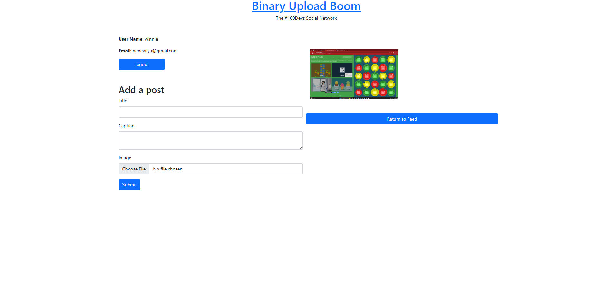

# Binary Upload Boom

A simple Node.js and Express web application that allows users to upload posts with images, comment on posts, like posts, and manage their own content. Users can view a feed of all posts and interact with other users’ posts in a community-style interface.  

---

## Description

**Binary Upload Boom** is a Node.js and Express-based web app that uses MongoDB for data storage. It allows authenticated users to manage their profiles, create posts with optional images, like and comment on posts, and delete posts they own. This project demonstrates CRUD operations, form handling with file uploads, and templating using **EJS**.  

Each post includes:  
- A **title**  
- A **caption**  
- Optional **image upload**  
- **Likes** from other users  
- **Comments** from other users  

---

## Features

- **User Authentication** — Each user logs in and can only manage their own posts.  
- **Create Posts** — Upload an image, add a title and caption.  
- **View Posts / Feed** — Browse all posts created by the community.  
- **Like Posts** — Users can like posts to show appreciation.  
- **Comment** — Users can leave comments on posts.  
- **Delete Posts** — Owners can remove posts they created.  
- **Responsive Design** — Simple and easy-to-use interface.  

---

## Tech Stack

| Component | Technology |
|------------|-------------|
| **Frontend** | HTML5, CSS3, EJS |
| **Backend** | Node.js, Express.js |
| **Database** | MongoDB (via Mongoose) |
| **Authentication** | Passport.js |
| **Environment Variables** | dotenv |
| **File Upload Handling** | Multer |
| **Cloud Storage** | Cloudinary |

---

## Installation & Setup

1. Clone the repository:  bash git clone https://github.com/WinnieYuDev/binary-upload-boom

2. Install modules `npm install`

---

# Things to add

- Create a `.env` file in config folder and add the following as `key = value`
  - PORT = 2121 (can be any port example: 3000)
  - DB_STRING = `your database URI`
  - CLOUD_NAME = `your cloudinary cloud name`
  - API_KEY = `your cloudinary api key`
  - API_SECRET = `your cloudinary api secret`

---

# Run

`npm start`
